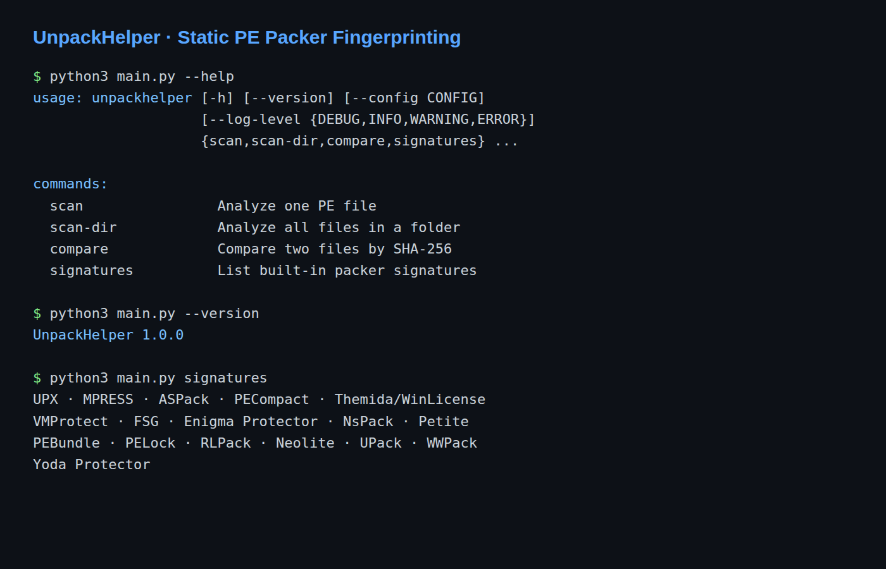
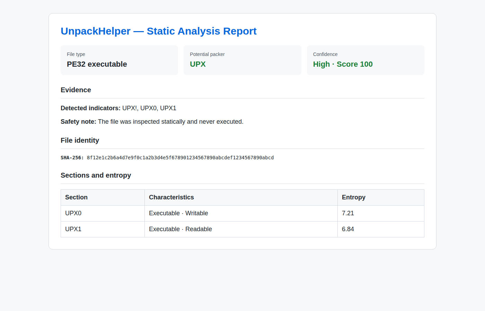

# UnpackHelper

**UnpackHelper** أداة تحليل ساكنة مكتوبة بلغة **Python** لاكتشاف مؤشرات برامج التغليف (Packers) داخل ملفات Windows PE مثل `.exe` و`.dll`. تقرأ الأداة بنية الملف وترويساته وأقسامه وبيانات Imports/Exports وبعض العلامات النصية، ثم تعرض الأدلة ودرجة الثقة دون تشغيل الملف أو فكّه في الذاكرة.

> **تنبيه أمني:** نتيجة الأداة احتمالية وليست حكمًا نهائيًا على سلامة الملف أو كونه ضارًا. وجود اسم Packer أو دالة مستوردة منفردة لا يثبت الخباثة.

## فكرة المشروع

صُمم UnpackHelper ليكون أداة تعليمية خفيفة لفهم التحليل الساكن لملفات PE. يجمع المشروع بين قراءة البنية الثنائية، حساب SHA-256، تحليل Entropy، مطابقة توقيعات Packers، وإنتاج تقارير نصية أو JSON أو HTML قابلة للمراجعة.

تتميز الأداة بأنها:

- لا تحتاج إلى مكتبات خارجية؛ تعتمد على Python Standard Library فقط.
- لا تنفذ الملفات التي يجري تحليلها ولا تستدعي برامج خارجية.
- تعمل على Windows وLinux وmacOS مع Python 3.9 أو أحدث.
- تتحقق من حدود البيانات قبل تحويل RVA إلى إزاحات داخل الملف.
- تعرض الأدلة المستخدمة ودرجة الثقة بدل إصدار حكم مبسط من نوع Safe/Malicious.
- تتعامل مع الملفات المفقودة، الفارغة، غير التابعة لـ PE، المبتورة أو التالفة، وملفات الإعدادات غير الصحيحة.

## لقطات شاشة

### واجهة سطر الأوامر

تعرض الواجهة الأوامر الأساسية مثل فحص ملف واحد، فحص مجلد، مقارنة SHA-256، واستعراض قاعدة التوقيعات.



### تقرير التحليل

يوضح التقرير هوية الملف، الـ Packer المحتمل، الأدلة، مستوى الثقة، وEntropy وخصائص الأقسام.



## المتطلبات والتثبيت

- Python 3.9 أو أحدث.
- لا توجد حزم خارجية مطلوبة.

```bash
git clone https://github.com/mauwyhalshame-design/unpackhelper.git
cd unpackhelper
python3 --version
```

## التشغيل السريع

```bash
python3 main.py --help
python3 main.py --version
python3 main.py signatures
python3 main.py scan sample.exe
python3 main.py scan sample.exe --json
python3 main.py scan sample.exe --html report.html
```

في Windows يمكن استخدام:

```powershell
py main.py scan C:\path\to\sample.exe
```

وفي Linux أو macOS:

```bash
python3 main.py scan /path/to/sample.exe
```

## الأوامر المتاحة

| الأمر | الوظيفة |
|---|---|
| `scan FILE` | تحليل ملف PE واحد وإظهار النتيجة والأدلة. |
| `scan FILE --json` | إخراج النتيجة بصيغة JSON. |
| `scan FILE --html report.html` | إنشاء تقرير HTML مستقل قابل للفتح في المتصفح. |
| `scan-dir DIRECTORY` | فحص الملفات داخل مجلد ومجلداته الفرعية. |
| `scan-dir DIRECTORY --no-recursive` | فحص مستوى المجلد الحالي فقط. |
| `scan-dir DIRECTORY --json --output report.json` | حفظ تقرير المجلد بصيغة JSON. |
| `scan-dir DIRECTORY --html folder_report.html` | إنشاء تقرير HTML للمجلد. |
| `compare FIRST SECOND` | مقارنة ملفين باستخدام SHA-256 فقط. |
| `signatures` | عرض Packers والتوقيعات المضمنة. |

يمكن أيضًا تحديد مستوى السجل أو ملف إعدادات:

```bash
python3 main.py --log-level INFO scan sample.exe
python3 main.py --config config.example.json scan sample.exe
```

## التحليل والتقييم

يحلل المشروع عدة طبقات من الأدلة:

1. **ترويسة PE:** التحقق من `MZ` و`PE\0\0` وقراءة خصائص الملف.
2. **الأقسام:** قراءة أسماء الأقسام وأحجامها وخصائص القراءة/الكتابة/التنفيذ.
3. **توقيعات Packers:** دعم مؤشرات UPX وMPRESS وASPack وPECompact وThemida/WinLicense وVMProtect وFSG وEnigma Protector وNsPack وPetite وPEBundle وPELock وRLPack وNeolite وUPack وWWPack وYoda Protector.
4. **Entropy:** حساب Shannon Entropy لكل قسم؛ القيمة بين 0 و8، وهي مؤشر إحصائي قد يساعد في الاشتباه بالضغط أو التشفير، لكنها ليست دليلًا منفردًا على الخباثة.
5. **Imports وExports:** قراءة المكتبات والوظائف المستوردة والوظائف المصدرة دون تشغيل الملف.
6. **التقييم:** دمج الأدلة في Score وConfidence مع إبقاء سبب النتيجة ظاهرًا للمحلل.

وجود Marker منفرد لا يرفع الثقة إلى High؛ أما اجتماع Marker مع أسماء أقسام مناسبة ودرجة مرتفعة فيعطي نتيجة أقوى. مثال:

```text
Packer: UPX
Evidence: UPX!, UPX0, UPX1
Score: 100
Confidence: High
```

## الاختبارات

يحتوي المشروع على اختبارات وحدات تغطي كشف UPX، قراءة PE32 وPE32+, Imports وExports، Entropy، تقارير HTML، مقارنة الملفات، فحص المجلدات، التحقق من الإعدادات، ومعالجة الأخطاء.

```bash
python3 -m unittest discover -s tests -v
```

## هيكل المشروع

```text
unpackhelper/
├── main.py                 # نقطة تشغيل CLI
├── cli.py                  # تعريف الأوامر والخيارات
├── pe_parser.py            # قراءة بنية PE وDirectories
├── signatures.py           # قاعدة توقيعات Packers
├── fingerprint.py          # مطابقة التوقيعات وحساب الأدلة
├── assessment.py           # تقييم النتيجة ومستوى الثقة
├── entropy.py              # حساب Shannon Entropy
├── report.py               # بناء النتيجة النصية وJSON
├── html_report.py          # إنشاء تقرير HTML
├── folder_scan.py          # فحص المجلدات وتجميع النتائج
├── compare.py              # مقارنة SHA-256
├── config.py               # قراءة والتحقق من الإعدادات
├── tests/                  # اختبارات المشروع
├── docs/screenshots/       # لقطات الشاشة المستخدمة في التوثيق
├── ARCHITECTURE.md         # شرح المعمارية ومسار البيانات
├── CHANGELOG.md            # سجل التغييرات
├── signature_research.md   # مصادر وحدود التوقيعات
└── config.example.json     # نموذج ملف الإعدادات
```

## الأمان والحدود

UnpackHelper أداة تحليل ساكنة وليست Sandbox أو Antivirus. لا تنفذ الملفات ولا تفك التغليف في الذاكرة، ولذلك فهي مناسبة للتعلم والتحليل الأولي. استخدم عينات اختبار معزولة، ولا تفتح الملفات المشبوهة أو تقرر سلامتها اعتمادًا على نتيجة هذه الأداة وحدها.

## ملف الإعدادات

يوجد `config.example.json` كنموذج. يحدد `max_file_size` الحد الأقصى لحجم الملف بالبايت، ما يساعد على منع استهلاك غير متوقع للذاكرة أثناء التحليل.

## التوثيق والرخصة التعليمية

- `ARCHITECTURE.md`: المعمارية ومسار البيانات.
- `CHANGELOG.md`: التغييرات والإصلاحات ونتائج الاختبارات.
- `discussion_notes.md`: ملاحظات الشرح والمناقشة.
- `signature_research.md`: مصادر اختيار التوقيعات وحدودها.

هذا المشروع نموذج تعليمي قابل للتوسعة. قبل استخدامه في بيئة إنتاجية، أضف عينات اختبار موثوقة، وسجّل الإصدارات، وراجع قواعد التوقيعات لتقليل النتائج الخاطئة.
